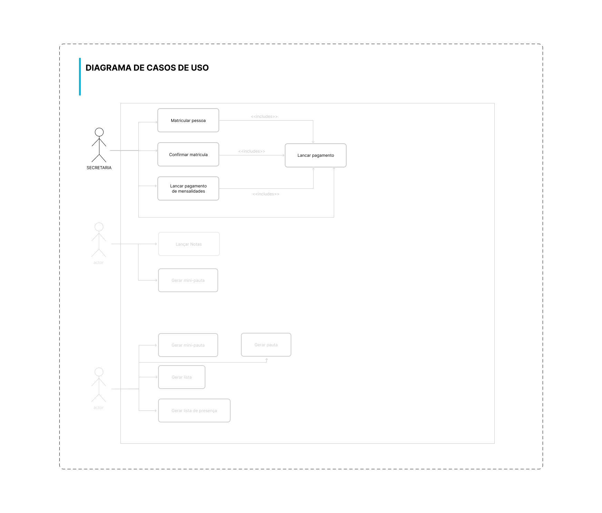

# apiSchoolite
Lite system for school manager

## Instalação de dependencias 
É necessário que use como versão minima do node v16.17.1

```sh
git clone
npm install
```

## Execução
Para rodar o sistema deverá executa o senguinte comando, que vai permaner ouvindo as mudanças

```sh 
npm run dev
```
Ou se não for necessário ouvir mudanças no código poderá executar

```sh
npm run dev:build
```

## Execução dos testes
Para rodar os teste deverá executar o seguinte comando

```sh
npm run test
```
ou se precisar ouvir as mudanças nos testes poderá rodar

```sh
npm run test:watch
```

## Funcionalidades

- [ ] Matricular pessoa
- [ ] Confirmar matricula
- [ ] Pagar mensalidade
- [ ] Lançar pagamento

## Arquitetura
Foi adoptada uma arquitetura em camadas com a regra de dependencia para o centro.

Teremos essencialmente 3 camadas: _domínio_, _aplicação(ou data)_ e _infraestrutura_


## Diagrama Entidade Relacionamento


## Diagrama de casos de uso

